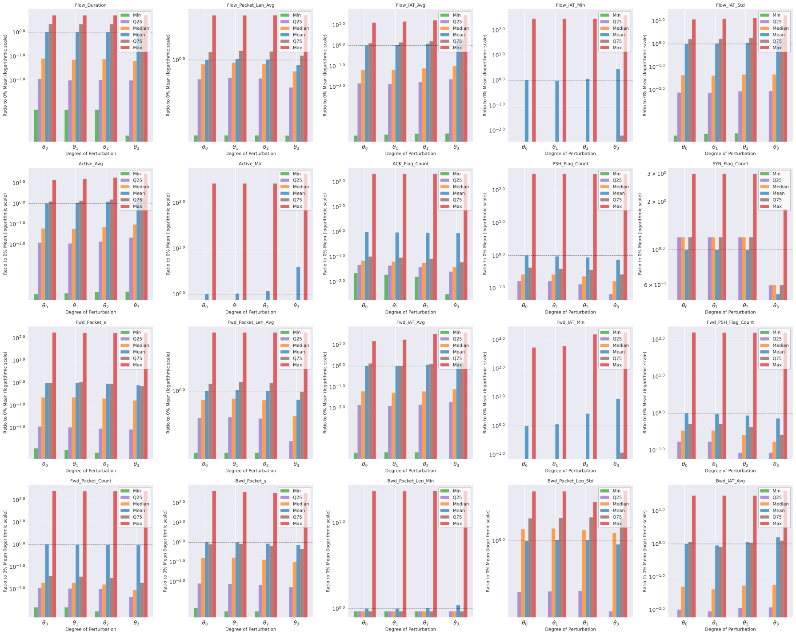

# TFReC  
the Visualization results of TFReC Feature Analysis  

## feature_change_trends_scatter  
  
x: Flow index  
y: 

## feature_statistics  
  
x: Perturbation intensity  
y: $y={{10}^{lg\left ({1+\frac{p(x)}{\mathrm{μ(0)}}}\right)}}$  
p(x): the statistics ($mean$, $median$, $max$, $min$, $Q_{25}$, $Q_{75}$) of feature in perturbation intexsity $x$
